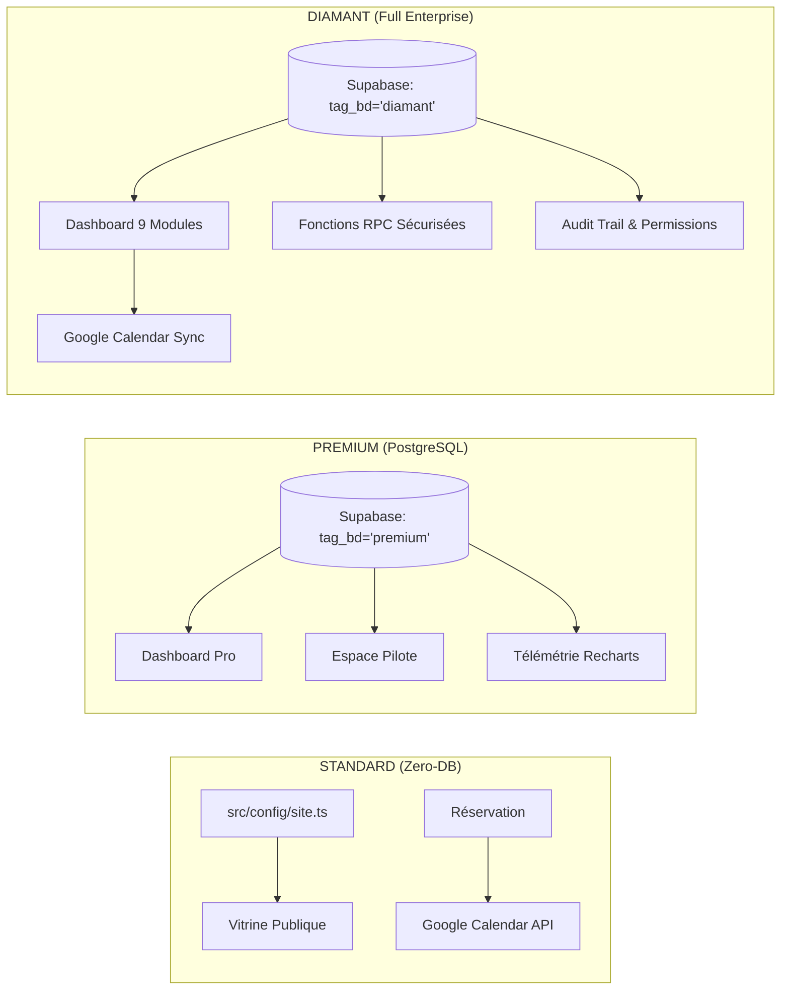
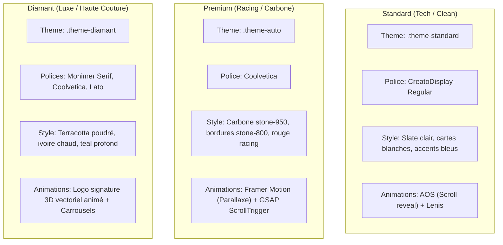

# Guide Comparatif Exhaustif — Les Différences entre les Démos

Ce document propose une analyse comparative détaillée, technique et commerciale des trois déclinaisons de la plateforme de réservation : **Standard**, **Premium** et **Diamant**.

---

## 1. Vue d'Ensemble & Positionnement Stratégique

La plateforme est conçue selon une architecture modulaire permettant de répondre à trois niveaux d'exigence et de maturité numérique :

```
┌────────────────────────────────────────────────────────────────────────────────────────────────────────┐
│                                       LES 3 PALIERS DE LA PLATEFORME                                    │
├──────────────────────────────┬────────────────────────────────────────┬────────────────────────────────┤
│       DÉMO STANDARD          │              DÉMO PREMIUM              │          DÉMO DIAMANT          │
├──────────────────────────────┼────────────────────────────────────────┼────────────────────────────────┤
│ « L'Essentiel & Zéro-DB »    │ « Le Choix des Pros »                  │ « Sur-Mesure Haute Couture »   │
│ • Artisans & solos           │ • Garages, PME de services             │ • Salons prestige, cliniques   │
│ • Zéro base de données       │ • Base relationnelle PostgreSQL        │ • Suite logicielle complète    │
│ • Google Calendar direct     │ • Espace client & Télémétrie           │ • RBAC, Droits, Modération     │
│ • Maintenance quasi-nulle    │ • Suivi de flotte / véhicule           │ • Messagerie Pro, Recherche    │
└──────────────────────────────┴────────────────────────────────────────┴────────────────────────────────┤
```

---

## 2. Matrice Comparative Globale

| Critère / Fonctionnalité | Démo Standard | Démo Premium | Démo Diamant |
| :--- | :--- | :--- | :--- |
| **Cas d'usage thématique** | **Dépannage Informatique** (*TechDom*) | **Garage Automobile** (*Arsenal Mécanique*) | **Maison de Haute Coiffure** (*Maison Prestige*) |
| **Univers graphique** | High-Tech clair (Slate, Bleu, Rouge) | Industriel sombre (Carbone, Rouge racing) | Luxe éditorial (Terracotta, Ivoire, Teal) |
| **Typographie principale** | *CreatoDisplay-Regular* | *Coolvetica* | *Monimer Serif*, *Coolvetica*, *Lato* |
| **Architecture Données** | **Zéro-DB** (Fichier de configuration typé) | **PostgreSQL / Supabase** (`tag_bd = 'premium'`) | **PostgreSQL / Supabase** (`tag_bd = 'diamant'`) |
| **Destination des RDV** | **Google Calendar direct** (via API) | **Base de données** (+ e-mails) | **Base de données + Google Calendar API** |
| **Authentification Client** | Optionnelle | Supabase Auth (E-mail & Google OAuth) | Supabase Auth (E-mail & Google OAuth) |
| **Espace Client dédié** | Optionnel / minimal | **Espace Pilote** complet | **Espace Client Prestige** complet |
| **Programme de Fidélité** | Non | Paliers & points d'atelier | **4 Paliers VIP** (Cristal, Argent, Or, Diamant) |
| **Dashboard Pro Atelier** | Basique (6 modules partagés) | **Industriel avec Télémétrie Recharts** | **Avancé (9 modules, RBAC, Recherche)** |
| **Analytique & Graphiques** | Métriques textuelles | **Recharts** (AreaChart CA + Top 5 Services) | **Recharts** (Évolution CA multi-périodes) |
| **Notes confidentielles clients**| Non | **Oui** (`client_notes` véhicule/moteur) | **Oui** (`client_notes` formules/soins) |
| **Messagerie Pro ↔ Client** | Non | **Oui** (Messagerie bilatérale sécurisée) | **Oui** (Messagerie instantanée avec statut lu) |
| **Gestion des Droits (RBAC)** | Non | Non | **3 Rôles** : Admin, Employé, Démo lecture seule |
| **Moteur de Modération** | Non | Non | **Bannissement avec motif & suppression cascade** |
| **Moteur de Recherche unifié** | Non | Non | **Recherche multi-critères instantanée** |
| **Animations & Rendu** | AOS + Lenis Smooth Scroll | Framer Motion (Parallaxe) + GSAP (Compteurs) | Logo 3D animé vectoriel + Carrousels dédiés |
| **Coût d'infrastructure** | **~0 € / mois** | **0 € à 25 € / mois** (selon trafic) | **0 € à 25 € / mois** (selon trafic) |
| **Investissement initial** | Formule la plus abordable | Milieu de gamme pro | Haut de gamme sur-mesure (dès 3000 €) |

---

## 3. Comparatif Détaillé par Axe Technique

### A. Gestion des Données et Stockage



#### 1. Démo Standard : La Philosophie « Zéro Base de Données »
- **Principe** : Tout le contenu métier (nom du commerce, descriptifs, tarifs, horaires, certifications) est défini dans [src/config/site.ts](file:///c:/Users/cash31/Desktop/reservation-platform/reservation-platform/src/config/site.ts) (`itRepairConfig`).
- **Avantages** :
  - **Zéro latence** : Les pages se compilent statiquement et sont servies depuis le cache Edge de Cloudflare.
  - **Sécurité absolue** : Aucune base SQL exposée sur le web public, éliminant les risques d'injection.
  - **Coût serveur nul** : L'artisan n'a pas besoin de souscrire d'abonnement de base de données.
- **Enregistrement des rendez-vous** : Le formulaire injecte directement les réservations dans le **Google Calendar** du professionnel via un compte de service chiffré (`/api/calendar.ts`).

#### 2. Démo Premium : La Base de Données Relationnelle Robuste
- **Principe** : Exploite une instance **PostgreSQL hébergée sur Supabase**, partitionnée grâce à la colonne `tag_bd = 'premium'`.
- **Modèle relationnel** :
  - Gestion dynamique des prestations (`services` : ajout, édition de prix, temps d'intervention).
  - Gestion des règles de disponibilité (`availability_rules`) et des fermetures exceptionnelles.
  - Carnet d'entretien privé (`client_notes`) permettant de consigner l'historique technique du véhicule.
  - Historisation des rendez-vous (`appointments`) servant de source de données pour les graphiques de CA.

#### 3. Démo Diamant : L'Écosystème Entreprise Complet
- **Principe** : Repose sur PostgreSQL avec des fonctionnalités avancées :
  - **Triggers automatiques** : Création instantanée de la fiche client lors de l'authentification (`handle_new_auth_user`).
  - **Fonctions d'administration sécurisées (RPC `SECURITY DEFINER`)** :
    - `ban_user_by_admin` : Verrouille l'utilisateur au niveau Auth et en base de données.
    - `unban_user_by_admin` : Réactive les accès du client.
    - `delete_user_by_admin` : Suppression en cascade de l'ensemble des données personnelles (RGPD).
  - **Double synchronisation** : Enregistrement en base PostgreSQL couplé à la synchronisation sur Google Calendar.

---

### B. Moteur de Réservation & Prise de Rendez-vous

```
┌────────────────────────────────────────────────────────────────────────────────────────┐
│                        COMPARAISON DES TUNNELS DE RÉSERVATION                          │
├──────────────────────────────┬────────────────────────────┬────────────────────────────┤
│           STANDARD           │          PREMIUM           │          DIAMANT           │
├──────────────────────────────┼────────────────────────────┼────────────────────────────┤
│ • Pas de compte nécessaire   │ • Compte pilote ou invité  │ • Compte VIP ou invité     │
│ • Créneaux de 1h prédéfinis  │ • Créneaux variables (min) │ • Créneaux sur-mesure      │
│ • Synchronisation G-Calendar │ • Enregistrement en BDD    │ • Enregistrement BDD + GC  │
│ • Rate-limit par cookie (3)  │ • Validation anti-collision│ • Blocage auto si banni    │
│ • Confirmation e-mail        │ • Confirmation e-mail      │ • Suivi fidélité VIP       │
└──────────────────────────────┴────────────────────────────┴────────────────────────────┘
```

- **Démo Standard** ([StandardReservationForm.tsx](file:///c:/Users/cash31/Desktop/reservation-platform/reservation-platform/src/components/reservation/StandardReservationForm.tsx)) :
  - L'automobiliste ou l'utilisateur choisit sa prestation dans une liste déroulante simple, sélectionne une date et valide son nom/téléphone/e-mail.
  - L'API crée l'événement dans Google Calendar et déclenche un e-mail de confirmation par Resend.
  - Un système de **Rate Limiting** via cookie sécurisé empêche les réservations abusives (3 max par session, 5 minutes d'écart).

- **Démo Premium** ([ReservationForm.tsx](file:///c:/Users/cash31/Desktop/reservation-platform/reservation-platform/src/components/reservation/ReservationForm.tsx)) :
  - Le tunnel interroge la table `availability_rules` pour calculer la disponibilité exacte en fonction de la durée propre au service (ex. 30 min pour un diagnostic, 180 min pour un lustrage céramique).
  - Empêche physiquement le double-booking grâce à l'index unique `idx_unique_confirmed_booking`.

- **Démo Diamant** ([ReservationForm.tsx](file:///c:/Users/cash31/Desktop/reservation-platform/reservation-platform/src/components/reservation/ReservationForm.tsx)) :
  - Bénéficie de la pré-sélection de soin depuis la vitrine avec transmission automatique de l'identifiant du service.
  - **Contrôle d'accès strict** : Si l'utilisateur est identifié sur la liste des comptes suspendus (`is_banned = true`), la réservation est bloquée immédiatement avec notification du motif.

---

### C. Espaces Clients & Fidélisation

#### Standard
- **Approche** : Volontairement épurée. Pas d'obligation de création de compte pour réserver.
- **Cible** : Clients ponctuels venant pour une urgence (panne d'ordinateur, écran cassé).

#### Premium (« Espace Pilote »)
- **Navigation** : [PremiumClientNav.tsx](file:///c:/Users/cash31/Desktop/reservation-platform/reservation-platform/src/components/premium/client/PremiumClientNav.tsx).
- **Fonctionnalités** :
  - Suivi des interventions programmées avec statut (*En attente* / *Confirmé*).
  - Reprogrammation ou annulation en ligne si le rendez-vous est dans plus de 24h.
  - Messagerie privée avec les mécaniciens de l'atelier ([MessagesClientPanel.tsx](file:///c:/Users/cash31/Desktop/reservation-platform/reservation-platform/src/components/client/MessagesClientPanel.tsx)).
  - Suivi des points d'atelier et privilèges fidélité ([LoyaltyClientPanel.tsx](file:///c:/Users/cash31/Desktop/reservation-platform/reservation-platform/src/components/client/LoyaltyClientPanel.tsx)).
  - Fiche profil mémorisant les détails techniques du véhicule.

#### Diamant (« Espace Client Prestige »)
- **Navigation** : `DiamantClientNav.tsx` avec garde-fou anti-suspension (`DiamantClientBanGuard.tsx`).
- **Historique complet des passages** : Consultation détaillée des rendez-vous antérieurs avec styliste associé, prestation et date.
- **Programme VIP 4 Paliers** : Moteur de fidélité [loyalty.ts](file:///c:/Users/cash31/Desktop/reservation-platform/reservation-platform/src/lib/loyalty.ts) avec barres de progression vers les statuts *Cristal*, *Argent*, *Or* et *Diamant*.
  - **Badges de Privilèges Débloqués** : *Diagnostic Capillaire Offert*, *Rituel Soin Signature*, *Remise permanente -20%*, *Cercle Ambassadeur*.
  - **Personnalisation Avancée** : Sélecteur d'avatar SVG DiceBear et mémo des préférences cosmétiques/allergies.

---

### D. Tableaux de Bord Professionnels (Dashboard Pro)

| Fonctionnalité Dashboard | Standard | Premium | Diamant |
| :--- | :---: | :---: | :---: |
| **Gestion des Rendez-vous** | Liste basique | **3 Onglets (Attente / Confirmé / Historique)** | **3 Onglets + Détail complet + Modale** |
| **Gestion des Prestations (CRUD)** | Oui | **Oui (avec Soft Delete & Images)** | **Oui (avec Soft Delete & Images)** |
| **Disponibilités & Congés** | Hebdomadaire | **Hebdo + Exceptions & Vacances** | **Hebdo + Exceptions & Vacances** |
| **Fichier Clients** | Liste simple | **Dossiers Pilotes + CA généré** | **Fichier VIP + Statistiques d'achats** |
| **Notes confidentielles pro** | Non | **Oui (`client_notes`)** | **Oui (`client_notes`)** |
| **Télémétrie / Analytics Graphiques** | Chiffres bruts | **Recharts (AreaChart CA + BarChart Services)** | **Recharts (Courbe financière multi-périodes)** |
| **Messagerie Pro intégrée** | Non | Via panel partagé | **Messagerie complète dédiée (`DiamantMessenger`)** |
| **Moteur de Recherche Multi-critères** | Non | Non | **Oui (`DiamantSearchPanel`)** |
| **Gestion d'Équipe & Rôles (RBAC)** | Non | Non | **Oui (`DiamantRightsPanel` : Admin / Collaborateur)** |
| **Mode Démo Commerciale (Read-Only)** | Non | Non | **Oui (Visite prospects sans écriture)** |
| **Modération & Bannissement Client** | Non | Non | **Oui (Bannissement Auth + suppression RGPD)** |

---

### E. Expérience Visuelle, Animations & Design System



1. **Démo Standard** :
   - Clarté maximale, sensation d'efficacité chirurgicale.
   - Idéal pour rassurer un client cherchant une intervention technique immédiate.

2. **Démo Premium** :
   - Ambiance garage haut de gamme / écurie de compétition automobile.
   - Parallaxe cinématique du Hero (`AutoHero.tsx`) avec image d'atelier en profondeur.
   - Compteurs odométriques animés par **GSAP et ScrollTrigger** lors du défilement.
   - Cartes de services avec élévation 3D et halo lumineux rouge au survol.

3. **Démo Diamant** :
   - Raffinement absolu, codes du luxe et de la haute joaillerie / haute coiffure.
   - **Logo signature 3D animé** ([Diamant3DLogo.tsx](file:///c:/Users/cash31/Desktop/reservation-platform/reservation-platform/src/components/diamant/Diamant3DLogo.tsx)) réagissant à l'interaction.
   - Contrastes doux, micro-animations discrètes valorisant le savoir-faire artisanal.

---

### F. Économie & Coûts d'Exploitation

| Poste de coût | Standard | Premium | Diamant |
| :--- | :--- | :--- | :--- |
| **Hébergement Frontend (Cloudflare)** | **0 € / mois** (Tier gratuit >100k req/j) | **0 € / mois** | **0 € / mois** |
| **Base de Données & Auth (Supabase)** | **0 € / mois** (Pas de BDD requise) | **0 € à 25 € / mois** (Gratuit jusqu'à 50k users) | **0 € à 25 € / mois** (Gratuit jusqu'à 50k users) |
| **API Synchronisation Calendrier** | **0 € / mois** (Google Cloud Free Tier) | N/A | **0 € / mois** (Google Cloud Free Tier) |
| **Expédition E-mails (Resend)** | **0 € / mois** (3000 emails/mois gratuits) | **0 € / mois** | **0 € / mois** |
| **Nom de domaine (annuel)** | ~15 € / an | ~15 € / an | ~15 € / an |
| **Coût d'infrastructure total estimé** | **~15 € / AN** | **~15 € / AN** (ou ~315 €/an avec Supabase Pro) | **~15 € / AN** (ou ~315 €/an avec Supabase Pro) |

---

## 4. Guide de Recommandation Client (Aide à la Décision)

Pour orienter un prospect ou un client vers la bonne formule, appliquez la grille de décision suivante :

### Choisissez la Formule STANDARD si :
- Le client est un **artisan seul ou un indépendant** (dépannage informatique, électricien, plombier, coach sportif, consultant).
- Il gère déjà tout son quotidien sur **Google Calendar** et ne veut pas apprendre à utiliser un nouveau logiciel complexe.
- Il a un **budget serré** et cherche le coût mensuel le plus bas possible.
- La priorité absolue est la **vitesse de chargement** et le référencement local (**SEO**).

### Choisissez la Formule PREMIUM si :
- Le client est une **PME ou un atelier** (garage auto, centre de contrôle technique, institut de beauté avec plusieurs postes).
- Il a besoin de suivre l'historique de ses prestations et d'annoter des détails confidentiels sur ses clients (dossier véhicule, remarques d'atelier).
- Il souhaite analyser son activité financière grâce à des **graphiques de chiffre d'affaires et de rentabilité**.
- Il veut proposer un espace client moderne permettant aux clients de suivre leurs réservations et de cumuler des avantages.

### Choisissez la Formule DIAMANT si :
- Le client est un **établissement haut de gamme ou une enseigne avec équipe** (salon de haute coiffure, spa de luxe, clinique esthétique, cabinet médical privé).
- Il y a plusieurs collaborateurs et la nécessité d'un **contrôle des permissions strict (RBAC)** : les employés accèdent au planning, mais seul le gérant accède aux finances et aux statistiques.
- Il est indispensable de pouvoir **bloquer/bannir les clients abusifs (*no-show*)** avec motif officiel.
- Le client souhaite un **programme de fidélité VIP multi-paliers avancé** et une messagerie instantanée directe avec l'équipe.
- L'image de marque exige un design ultra-personnalisé, une typographie signature et une identité visuelle d'exception.
