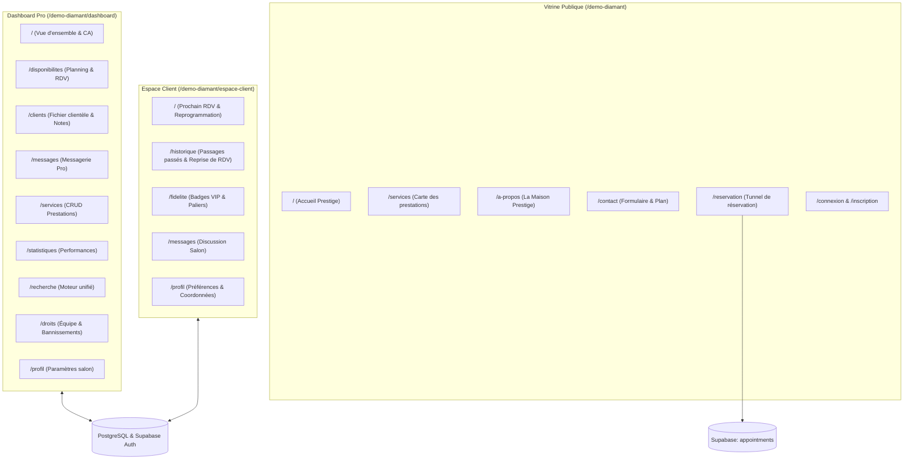
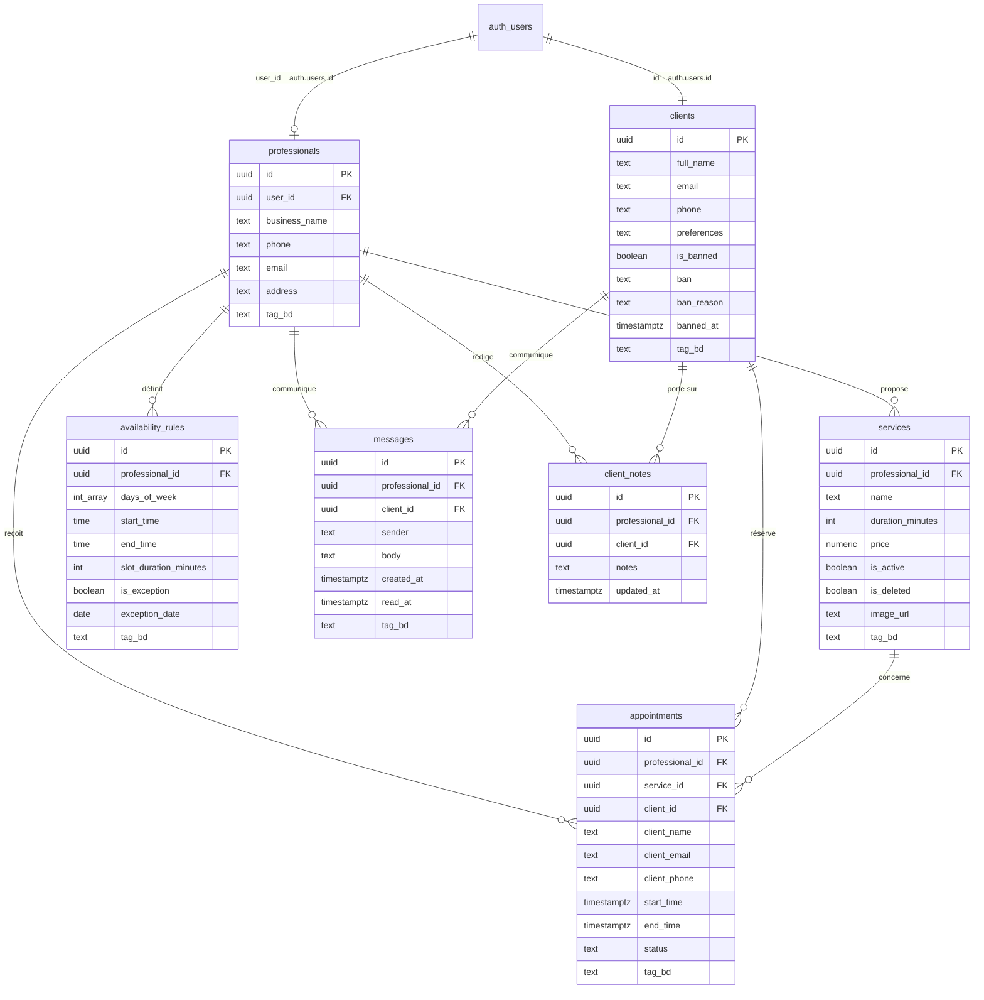

# Présentation Technique & Fonctionnelle — Démo Diamant

Ce document détaille l'ensemble des pages, des fonctionnalités, des outils, du modèle de données et de la sécurité régissant la **Démo Diamant** de la plateforme de réservation.

---

## 1. Vue d'ensemble & Positionnement

La **Démo Diamant** représente la formule **« Sur-Mesure & Haut de Gamme »** de la plateforme. Conçue autour d'un cas d'usage d'exception — une **Maison de Haute Coiffure / Salon Prestige** —, elle offre une suite logicielle complète composée d'un site vitrine haut de gamme, d'un tunnel de réservation interactif, d'un espace client enrichi (fidélité, historique des réservations) et d'un tableau de bord de gestion d'entreprise (analytics, équipe, modération, messagerie).

### Stack technique
- **Framework & Rendu** : **Astro v7** (mode hybride / SSR sur Cloudflare Workers) associé à **React 19** pour les îlots interactifs.
- **Styling & Design System** : **Tailwind CSS v4**, composants **shadcn / Base UI**, typographies personnalisées (*Coolvetica*, *Monimer Serif*, *Lato*), palette terracotta/teal/ivoire.
- **Animations & Expérience Visuelle** : **AOS** (*Animate On Scroll*), **Lenis** (*Smooth Scroll*), logo signature animé vectoriel (`Diamant3DLogo.tsx`).
- **Visualisation & Cartographie** : **Recharts** (courbes de CA et statistiques), **Leaflet** (carte avec fond CartoDB Positron sans clé payante).
- **Backend & Données** : **Supabase** (PostgreSQL, Auth, RLS, Storage, RPC).
- **Services tiers** : **Resend** (notifications et emails transactionnels), **Google Calendar API** (synchronisation d'agenda via JWT de compte de service).

---

## 2. Architecture Globale



---

## 3. Détail Exhaustif des Pages et Fonctionnalités

### A. Partie Vitrine Publique (`/demo-diamant/*`)

| Page | Fichier source | Fonctionnalités clés |
| :--- | :--- | :--- |
| **Accueil Prestige** | `src/pages/demo-diamant/index.astro` | • Hero section avec logo signature vectoriel animé `Diamant3DLogo`.<br>• Carrousel interactif des prestations phares branché en direct sur la base de données via `ServicesCarousel`.<br>• Présentation de l'expérience salon et avis clients certifiés via `TestimonialsCarousel`.<br>• Carte interactive Leaflet (`Map.astro`). |
| **Services / Carte** | `src/pages/demo-diamant/services.astro` | • Liste exhaustive des prestations via `ServicesList.tsx` (durée, tarif, description, image).<br>• Bouton « Réserver » avec pré-sélection automatique de l'ID du service sur le formulaire. |
| **La Maison (À Propos)** | `src/pages/demo-diamant/a-propos.astro` | • Récit de l'artisan coiffeur, engagements qualité et certifications professionnelles. |
| **Contact** | `src/pages/demo-diamant/contact.astro` | • Coordonnées et horaires d'ouverture dynamiques.<br>• Formulaire avec expédition d'e-mail via l'API `send-email.ts`. |
| **Réservation en ligne** | `src/pages/demo-diamant/reservation.astro` | • Formulaire complet multi-étapes (`ReservationForm.tsx`) :<br>1. Choix du soin.<br>2. Sélection de date et calcul des créneaux disponibles à la volée (`slots.ts`).<br>3. Coordonnées (préremplies si connecté en client).<br>• Blocage immédiat si le client est répertorié comme **banni/suspendu**.<br>• Notification e-mail automatique au client et au professionnel. |
| **Authentification** | `src/pages/demo-diamant/connexion.astro`<br>`src/pages/demo-diamant/inscription.astro` | • Formulaires `LoginForm.tsx` et `SignupForm.tsx`.<br>• Connexion par e-mail ou **Google OAuth**.<br>• Onboarding pour finaliser le profil (téléphone, préférences) via `CompleteProfileForm.tsx`.<br>• Redirection selon le rôle (Pro vers Dashboard, Client vers Espace Client). |
| **Récupération compte** | `src/pages/demo-diamant/mot-de-passe-oublie.astro`<br>`src/pages/demo-diamant/reinitialiser-mot-de-passe.astro` | • Procédure de reset password gérée de bout en bout via Supabase Auth. |
| **Mentions Légales & RGPD** | `src/pages/demo-diamant/mentions-legales.astro`<br>`src/pages/demo-diamant/conditions-utilisation.astro`<br>`src/pages/demo-diamant/politique-de-confidentialite.astro` | • Mentions légales, conditions d'utilisation et politique de traitement des données personnelles. |
| **Page d'Erreur** | `src/pages/demo-diamant/404.astro` | • Page 404 stylisée intégrée au thème Diamant. |
| **Page Commerciale** | `src/pages/galerie/diamant.astro` | • Présentation marketing de l'offre Diamant (philosophie du sur-mesure, stack technologique, modèle économique). |

---

### B. Espace Professionnel / Tableau de Bord (`/demo-diamant/dashboard/*`)

Toutes les pages d'administration s'appuient sur le layout dédié `DiamantDashboardLayout.astro` et la barre latérale `DiamantDashboardNav.tsx`.

1. **Tableau de Bord & Vue d'ensemble** (`dashboard/index.astro`) :
   - Protégé par `DiamantAdminOnlyGuard.tsx` (inaccessible aux simples collaborateurs).
   - Métriques en temps réel : Chiffre d'Affaires cumulé, total de réservations, nouveaux clients enregistrés, panier moyen.
   - Sélecteur de période : 7 derniers jours, 30 jours, 1 an ou dates personnalisées.
   - Graphique interactif d'évolution financière (`DiamantRevenueChart.tsx`) réalisé avec **Recharts**.
   - Modale détaillée des nouveaux clients (`DiamantNewClientsModal.tsx`).

2. **Planning & Rendez-vous** (`dashboard/disponibilites.astro`) :
   - Exploite le composant `AppointmentsPanel.tsx`.
   - 3 onglets de gestion : **En attente** (avec boutons Confirmer / Refuser), **Confirmés**, et **Historique**.
   - Fiche modale détaillée de chaque rendez-vous (prestations, coordonnées, tarif, durée).

3. **Clientèle & Dossiers Clients** (`dashboard/clients.astro`) :
   - Exploite `ClientsPanel.tsx`.
   - Répertoire de tous les clients ayant déjà réservé ou créé un compte.
   - **Notes privées du professionnel** : champ confidentiel stocké dans la table `client_notes`, invisible pour le client, permettant d'enregistrer des détails techniques (ex. type de coloration, formule personnalisée).
   - Accès direct au fil de messagerie du client.

4. **Messagerie Salon** (`dashboard/messages.astro`) :
   - Composant `DiamantMessenger.tsx`.
   - Liste des conversations avec pastille de messages non lus et dernier extrait.
   - Dialogue instantané pro ↔ client, horodatage, accusés de lecture.

5. **Gestion des Prestations** (`dashboard/services.astro`) :
   - CRUD complet des forfaits et prestations (`ServicesPanel.tsx`).
   - Modification en direct du tarif, du temps de réalisation, du nom et de la description.
   - Upload de photo d'illustration via le bucket Supabase Storage `service-images`.
   - **Soft delete** (`is_deleted = true`) : supprime la prestation de la vitrine sans rompre les liaisons comptables des réservations passées.

6. **Performances & Statistiques** (`dashboard/statistiques.astro`) :
   - Composant `DiamantPerformancePanel.tsx`.
   - Classement des prestations les plus rentables et les plus demandées.
   - Taux d'annulation et statistiques de fréquentation sur périodes comparatives.

7. **Recherche Unifiée** (`dashboard/recherche.astro`) :
   - Panneau `DiamantSearchPanel.tsx`.
   - Recherche multi-critères instantanée sur les rendez-vous par : nom client, e-mail, téléphone ou libellé de service.

8. **Profil de la Maison** (`dashboard/profil.astro`) :
   - Composant `DiamantProProfile.tsx`.
   - Modification du nom de l'établissement, du téléphone, de l'adresse et de la description, synchronisés instantanément en base de données et répercutés sur le site vitrine.

9. **Gestion des Droits & Modération** (`dashboard/droits.astro`) :
   - Panneau central `DiamantRightsPanel.tsx` :
     - **Onglet Équipe & Collaborateurs** : Ajout de comptes collaborateurs/admins, définition de spécialités, mot de passe direct, activation/suspension.
     - **Onglet Modération Clientèle** : Bannissement d'un client abusif avec motif officiel (*no-show*, comportement inadapté), déblocage, ou suppression définitive du compte.
     - **Onglet Matrice des Permissions** : Référentiel clair comparant les privilèges de chaque rôle.

---

### C. Espace Personnel Client (`/demo-diamant/espace-client/*`)

Protégé et structuré par la barre de navigation `DiamantClientNav.tsx` et le garde-fou `DiamantClientBanGuard.tsx`.

1. **Mes Rendez-vous** (`espace-client/index.astro`) :
   - Prochain rendez-vous avec statut en direct (`En attente` / `Confirmé`).
   - Reprogrammation / modification de créneau possible directement en ligne si le rendez-vous a lieu à **plus de 24 heures**.
   - Aperçu de l'historique récent (`DiamantClientRecentHistory.tsx`).

2. **Historique des Rendez-vous** (`espace-client/historique.astro`) :
   - Composant `DiamantClientHistory.tsx`.
   - Liste des prestations passées avec nom du styliste/coiffeur, date, tarif et statut.
   - Fiche récapitulative détaillée du passage avec points fidélité acquis.
   - Bouton de réengagement : « Reprendre ce rendez-vous ».

3. **Programme de Fidélité & Privilèges** (`espace-client/fidelite.astro`) :
   - Composant `DiamantClientFidelite.tsx` et moteur de calcul `loyalty.ts`.
   - Calcul des points et passages réels en base de données.
   - **4 Paliers VIP** : Cristal, Argent, Or, Diamant.
   - Système de badges déverrouillables : *Diagnostic Capillaire Offert*, *Rituel Soin Signature*, *Remise permanente -20%*, *Cadeau Anniversaire*, *Cercle Ambassadeur*.
   - Alertes des bonus acquis pour le prochain passage (ex. soin offert tous les 3 passages).

4. **Messagerie Client** (`espace-client/messages.astro`) :
   - Échanges directs et confidentiels avec l'équipe du salon.

5. **Mon Profil** (`espace-client/profil.astro`) :
   - Composant `DiamantClientProfile.tsx`.
   - Informations personnelles (Nom, Téléphone, E-mail).
   - Sélecteur d'avatar SVG personnalisé (via DiceBear).
   - Bloc de préférences personnalisées (nature du cheveu, allergies, attentes particulières) mémorisé pour les prestations futures.

---

## 4. La Base de Données : Modèle Relationnel & Utilisation

Le projet utilise **PostgreSQL hébergé sur Supabase**. L'accès aux données est centralisé dans `src/lib/queries.ts`.

### Modèle Relationnel



### Fonctionnalités de Base de Données Avancées
1. **Partitionnement Multi-Démos (`tag_bd`)** : Chaque table intègre une colonne `tag_bd` (valeur `'diamant'` pour cette démo). Cela permet d'héberger plusieurs démos indépendantes (Standard, Premium, Diamant) sur un seul projet Supabase sans collision de données.
2. **Synchronisation Automatique Auth ↔ Clients** : Le trigger PostgreSQL `on_auth_user_created` exécute la fonction `handle_new_auth_user()` pour créer immédiatement la fiche client dans `public.clients` dès qu'un utilisateur s'inscrit par e-mail ou via Google OAuth.
3. **Fonctions Administratives Sécurisées (RPC `SECURITY DEFINER`)** :
   - `public.ban_user_by_admin(target_user_id, reason)` : marque le client banni dans `public.clients` et verrouille son compte dans `auth.users` (`banned_until = 2999-01-01`).
   - `public.unban_user_by_admin(target_user_id)` : lève les sanctions en base et déverrouille l'accès.
   - `public.delete_user_by_admin(target_user_id)` : effectue une suppression atomique en cascade (rendez-vous, messages, notes, profil client, et identité d'authentification Supabase).

---

## 5. Sécurité et Contrôle d'Accès

### A. Sécurité au Niveau Base de Données (PostgreSQL RLS)
- Toutes les tables ont la sécurité `ROW LEVEL SECURITY` activée (`supabase/schema.sql`).
- **Isolation des accès professionnels** : Un professionnel ne peut consulter, modifier ou supprimer que les données rattachées à son propre `auth.uid() = user_id`.
- **Confidentialité des notes (`client_notes`)** : Seul le professionnel propriétaire peut lire ou modifier les notes sur ses clients ; aucune policy ne permet la lecture par le client.
- **Protection des rendez-vous** : Les clients connectés ne voient que leurs propres rendez-vous (`auth.uid() = client_id`).

### B. Contrôle d'Accès par Rôles (RBAC)
Le système distingue 3 rôles professionnels définis dans `src/lib/permissions.ts` :
1. **Administrateur / Gérant (`admin`)** : Accès sans restriction à tous les onglets (chiffre d'affaires, gestion de l'équipe, modification des tarifs, modération et bannissements).
2. **Employé / Collaborateur (`employee`)** : Accès opérationnel restreint au **Planning**, à la **Clientèle**, à la **Messagerie** et à la **Recherche**. Les sections financières (tableau de bord, statistiques, prestations, profil, droits) sont physiquement bloquées par `DiamantAdminOnlyGuard.tsx`.
3. **Mode Démo Commerciale (`demo`)** : Permet une visite complète de tous les onglets pour des présentations commerciales ou des prospects, mais **en lecture seule** (`isRoleReadOnly()`), empêchant toute écriture ou suppression de données.

### C. Système de Bannissement et Verrouillage d'Accès
- Tout client banni par l'administrateur est bloqué à la source :
  - **Au niveau Auth** : la session est invalidée via `banned_until`.
  - **Au niveau Formulaire de Connexion** : `LoginForm.tsx` et `OAuthCallback.tsx` contrôlent le statut du client et bloquent la connexion avec affichage du motif.
  - **Au niveau Espace Client** : `DiamantClientBanGuard.tsx` masque le contenu du dashboard et affiche un panneau rouge de suspension.
  - **Au niveau Réservation** : Impossible pour un client banni de réserver, même en mode invité (vérification sur e-mail et nom).

### D. Intégrité des Réservations (Anti-Double-Booking)
- Un index unique partiel sur la table `appointments` garantit au niveau PostgreSQL qu'aucun créneau ne peut être réservé en double pour un même professionnel :
  ```sql
  CREATE UNIQUE INDEX idx_unique_confirmed_booking
  ON public.appointments (professional_id, start_time)
  WHERE status = 'confirmed';
  ```
- Rejet automatique des réservations dans le passé dans `slots.ts` et au niveau de l'insertion dans `queries.ts`.

### E. Sécurité des APIs et Variables d'Environnement
- Les clés sensibles (clé de service Supabase `service_role`, clés privées Google `GOOGLE_PRIVATE_KEY`, clé API Resend `RESEND_API_KEY`) sont confinées aux routes serveurs (`src/pages/api/calendar.ts`, `src/pages/api/send-email.ts`) et ne sont jamais exposées au client navigateur.
- Rate limiting appliqué sur les réservations via cookie sécurisé HTTP-only (`calendar_sync_history`).

---

## 6. Synthèse des Outils et Bibliothèques Utilisés

| Outil / Bibliothèque | Version / Type | Rôle dans la Démo Diamant |
| :--- | :--- | :--- |
| **Astro** | v7.1.1 | Moteur de rendu SSR / Jamstack et routage basé sur les fichiers. |
| **React** | v19.2.7 | Logique dynamique des îlots interactifs (formulaires, tableaux de bord, modales). |
| **@supabase/supabase-js** | v2.110.7 | Client pour PostgreSQL, Authentification et Storage. |
| **Tailwind CSS** | v4.3.3 | Design system moderne avec variables de thème et polices personnalisées. |
| **Recharts** | v3.10.1 | Tracé des courbes de Chiffre d'Affaires et des volumes de RDV. |
| **Leaflet** | v1.9.4 | Affichage de la carte géographique interactive sans frais d'API. |
| **AOS & Lenis** | v2.3.4 / v1.3.26 | Animations fluides au scroll et effets d'apparition des sections. |
| **React Hook Form & Zod** | v7.82 / v4.4 | Validation typée et sécurisée de tous les formulaires (contact, profil, réservation). |
| **Jose** | v6.2.12 | Signature cryptographique PKCS#8 / RS256 pour l'accès sécurisé à Google Calendar API. |
| **Lucide React** | v1.25.0 | Bibliothèque d'icônes vectorielles cohérentes pour toute l'interface. |
