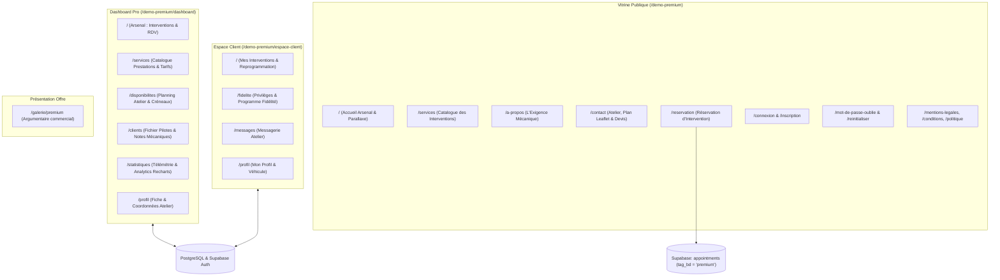
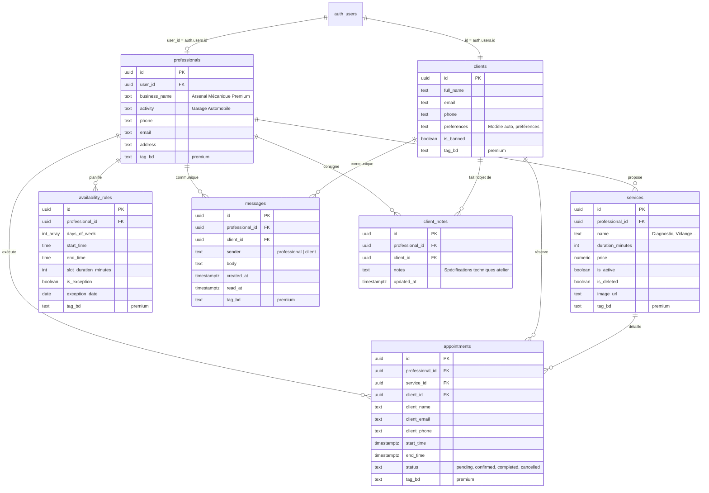

# Présentation Technique & Fonctionnelle — Démo Premium

Ce document détaille l'ensemble des pages, des fonctionnalités, des outils, du modèle de données et de la sécurité régissant la **Démo Premium** de la plateforme de réservation.

---

## 1. Vue d'ensemble & Positionnement

La **Démo Premium** incarne la formule **« Le Choix des Pros — Contrôle Total des Données »**. Conçue autour d'un cas d'usage axé sur la performance technique — un **Garage Automobile & Centre d'Expertise Mécanique (« Arsenal Mécanique »)** —, elle offre une suite logicielle complète intégrant :
- Un **site vitrine haute performance** au design industriel sombre et dynamique,
- Un **tunnel de réservation d'interventions mécaniques** interactif et intelligent,
- Un **espace client dédié (« Espace Pilote »)** avec suivi des rendez-vous, programme de privilèges/fidélité et messagerie directe avec l'atelier,
- Un **tableau de bord de gestion d'atelier** complet avec télémétrie financière en temps réel, gestion des interventions, catalogue des prestations et carnet d'entretien client (notes privées).

### Stack technique
- **Framework & Rendu** : **Astro v7** (mode SSR / hybride sur Cloudflare Workers) associé à **React 19** pour les îlots interactifs (*Astro Islands*).
- **Styling & Design System** : **Tailwind CSS v4**, variables thématiques dédiées (`.theme-auto`), typographie de titrage sportive et percutante (*Coolvetica*), palette carbone sombre (`bg-stone-950`, `bg-stone-900`, bordures `stone-800`) rehaussée d'accents rouge racing néon (`oklch(0.6 0.25 25)` / `text-primary`).
- **Animations & Expérience Visuelle** : 
  - **Framer Motion** : Parallaxe fluide au défilement dans le Hero (`useScroll`, `useTransform`) et effets de lévitation 3D / survol des cartes de services (`whileHover`).
  - **GSAP & ScrollTrigger** : Compteurs kilométriques / odomètres animés se déclenchant à l'apparition des statistiques à l'écran.
  - **AOS** (*Animate On Scroll*) & **Lenis** (*Smooth Scroll*) : Apparitions séquentielles des sections et défilement cinématique.
- **Visualisation & Cartographie** : 
  - **Recharts** : Télémétrie financière dynamique avec graphiques en courbes de CA (*AreaChart*) et classement horizontal des prestations les plus rentables (*BarChart*).
  - **Leaflet** : Cartographie interactive intégrée pour localiser l'atelier sans surcoût d'API externe (fond de carte *CartoDB Positron*).
- **Backend & Données** : **Supabase** (PostgreSQL relationnel, Row Level Security, Supabase Auth, Storage de photos de prestations).
- **Services tiers** : **Resend** (notifications et confirmations d'interventions par e-mail), **Google Calendar API** (synchronisation d'agenda pro optionnelle via JWT RS256).

---

## 2. Architecture Globale



---

## 3. Détail Exhaustif des Pages et Fonctionnalités

### A. Partie Vitrine Publique (`/demo-premium/*`)

Toutes les pages vitrine reposent sur le layout dédié [PremiumAutoLayout.astro](file:///c:/Users/cash31/Desktop/reservation-platform/reservation-platform/src/layouts/PremiumAutoLayout.astro), appliquant la classe `theme-auto`, la barre d'en-tête [PremiumHeader.astro](file:///c:/Users/cash31/Desktop/reservation-platform/reservation-platform/src/components/premium/PremiumHeader.astro) et le pied de page [PremiumFooter.astro](file:///c:/Users/cash31/Desktop/reservation-platform/reservation-platform/src/components/premium/PremiumFooter.astro).

| Page | Fichier source | Fonctionnalités clés |
| :--- | :--- | :--- |
| **Accueil Atelier** | [index.astro](file:///c:/Users/cash31/Desktop/reservation-platform/reservation-platform/src/pages/demo-premium/index.astro) | • **Hero Parallaxe Framer Motion** ([AutoHero.tsx](file:///c:/Users/cash31/Desktop/reservation-platform/reservation-platform/src/components/premium/AutoHero.tsx)) : image d'atelier premium en profondeur avec effet de déplacement différentiel au scroll, badge « Excellence Mécanique », typographie *Coolvetica* imposante, bouton avec animation de reflet (*shine*) menant à la réservation.<br>• **Odomètres GSAP** ([AutoStats.tsx](file:///c:/Users/cash31/Desktop/reservation-platform/reservation-platform/src/components/premium/AutoStats.tsx)) : 4 compteurs animés à l'arrivée dans le viewport via `ScrollTrigger` (*3500+ Véhicules Réparés*, *98% Clients Fidèles*, *120 Points de Contrôle*, *15 Années d'Expertise*).<br>• **Grille de Services 3D** ([AutoServicesGrid.tsx](file:///c:/Users/cash31/Desktop/reservation-platform/reservation-platform/src/components/premium/AutoServicesGrid.tsx)) : cartes interactives avec élévation et halo rouge au survol.<br>• **CTA Final immersif** avec dégradé radial et bouton d'action lumineux vers `/reservation`. |
| **Catalogue des Services** | [services.astro](file:///c:/Users/cash31/Desktop/reservation-platform/reservation-platform/src/pages/demo-premium/services.astro) | • Présentation détaillée de l'arsenal mécanique (Diagnostic, Bilan de santé, Réparation moteur, Pneumatiques, Lavage haute pression, Détailing intérieur).<br>• Section devis sur-mesure pour projets spéciaux (préparation moteur, covering, reprogrammation) renvoyant vers le contact. |
| **L'Exigence Mécanique (À Propos)** | [a-propos.astro](file:///c:/Users/cash31/Desktop/reservation-platform/reservation-platform/src/pages/demo-premium/a-propos.astro) | • Histoire de l'écurie : origines en sport automobile et compétition mises au service des véhicules particuliers.<br>• Photo d'atelier grand angle avec effet de zoom et transition de couleur noir & blanc vers couleur.<br>• **3 Engagements Forts** : *Transparence Totale* (devis systématique avant travaux), *Pièces Premium* (pièces certifiées constructeur/performance), *Garantie Intervention*. |
| **Contact & Plan d'Accès** | [contact.astro](file:///c:/Users/cash31/Desktop/reservation-platform/reservation-platform/src/pages/demo-premium/contact.astro) | • Coordonnées complètes, ligne d'assistance téléphonique directe et e-mail.<br>• Horaires d'ouverture par journée d'activité.<br>• **Carte interactive Leaflet** ([Map.astro](file:///c:/Users/cash31/Desktop/reservation-platform/reservation-platform/src/components/Map.astro)) avec repère précis du garage.<br>• Formulaire de contact stylisé avec expédition automatique de message via l'API serveur `/api/send-email.ts`. |
| **Réservation d'Intervention** | [reservation.astro](file:///c:/Users/cash31/Desktop/reservation-platform/reservation-platform/src/pages/demo-premium/reservation.astro) | • Tunnel interactif complet via [ReservationForm.tsx](file:///c:/Users/cash31/Desktop/reservation-platform/reservation-platform/src/components/reservation/ReservationForm.tsx) :<br>1. *Sélection de la prestation* (filtrée par `tag_bd = 'premium'`).<br>2. *Choix du créneau* : calcul dynamique des disponibilités en temps réel via [slots.ts](file:///c:/Users/cash31/Desktop/reservation-platform/reservation-platform/src/lib/slots.ts) selon les règles d'ouverture et les rendez-vous existants.<br>3. *Informations pilote* (nom, téléphone, e-mail, modèle de véhicule/notes).<br>• Protection anti-collision et confirmation instantanée. |
| **Authentification Pilote & Pro** | [connexion.astro](file:///c:/Users/cash31/Desktop/reservation-platform/reservation-platform/src/pages/demo-premium/connexion.astro)<br>[inscription.astro](file:///c:/Users/cash31/Desktop/reservation-platform/reservation-platform/src/pages/demo-premium/inscription.astro) | • Formulaires [LoginForm.tsx](file:///c:/Users/cash31/Desktop/reservation-platform/reservation-platform/src/components/auth/LoginForm.tsx) et [SignupForm.tsx](file:///c:/Users/cash31/Desktop/reservation-platform/reservation-platform/src/components/auth/SignupForm.tsx).<br>• Connexion par e-mail ou authentification unique **Google OAuth**.<br>• Redirection intelligente selon le statut : professionnel dirigé vers le Dashboard `/dashboard`, pilote vers `/espace-client`. |
| **Récupération de compte** | [mot-de-passe-oublie.astro](file:///c:/Users/cash31/Desktop/reservation-platform/reservation-platform/src/pages/demo-premium/mot-de-passe-oublie.astro)<br>[reinitialiser-mot-de-passe.astro](file:///c:/Users/cash31/Desktop/reservation-platform/reservation-platform/src/pages/demo-premium/reinitialiser-mot-de-passe.astro) | • Workflow sécurisé de réinitialisation de mot de passe par e-mail opéré par Supabase Auth. |
| **Pages Légales & RGPD** | [mentions-legales.astro](file:///c:/Users/cash31/Desktop/reservation-platform/reservation-platform/src/pages/demo-premium/mentions-legales.astro)<br>[conditions-utilisation.astro](file:///c:/Users/cash31/Desktop/reservation-platform/reservation-platform/src/pages/demo-premium/conditions-utilisation.astro)<br>[politique-de-confidentialite.astro](file:///c:/Users/cash31/Desktop/reservation-platform/reservation-platform/src/pages/demo-premium/politique-de-confidentialite.astro) | • Conformité légale complète, droits d'accès aux données personnelles et CGU adaptées aux prestations de réparation. |
| **Page d'Erreur 404** | [404.astro](file:///c:/Users/cash31/Desktop/reservation-platform/reservation-platform/src/pages/demo-premium/404.astro) | • Écran d'erreur 404 personnalisé avec bouton d'évacuation rapide vers l'accueil du garage. |
| **Page Commerciale Formule** | [galerie/premium.astro](file:///c:/Users/cash31/Desktop/reservation-platform/reservation-platform/src/pages/galerie/premium.astro) | • Vitrine de vente pour les prospects B2B : explicitation de la formule Premium (« Le choix des Pros »), démonstration de la valeur ajoutée d'une base relationnelle SQL, rentabilité et fonctionnalités clés. |

---

### B. Espace Professionnel / Tableau de Bord Atelier (`/demo-premium/dashboard/*`)

Toutes les pages d'administration s'articulent autour du layout [PremiumDashboardLayout.astro](file:///c:/Users/cash31/Desktop/reservation-platform/reservation-platform/src/layouts/PremiumDashboardLayout.astro) et de la barre latérale [PremiumDashboardNav.tsx](file:///c:/Users/cash31/Desktop/reservation-platform/reservation-platform/src/components/premium/dashboard/PremiumDashboardNav.tsx). L'interface offre un contraste ergonomique remarquable : une barre latérale noire industrielle avec le logo clé à molette (`Wrench`) et une zone de travail claire en ton `stone-50`.

```
┌─────────────────────────┬────────────────────────────────────────────────────────────────────────┐
│  ARSENAL MÉCANIQUE      │  TÉLÉMÉTRIE (Statistiques d'Activité)                                  │
│  [Wrench] Garage Pro    │                                                                        │
│                         │  [ 7 Jours ] [ 30 Jours ] [ 90 Jours ]                                 │
│  • Arsenal (RDV)        │                                                                        │
│  • Services             │  ┌──────────────────┐ ┌──────────────────┐ ┌──────────────────┐        │
│  • Disponibilités       │  │ CHIFFRE D'AFFAIRES│ │ INTERVENTIONS    │ │ PANIER MOYEN     │        │
│  • Pilotes              │  │ 2 840 €          │ │ 18               │ │ 157 €            │        │
│  • Télémétrie           │  └──────────────────┘ └──────────────────┘ └──────────────────┘        │
│  • Mécanicien           │                                                                        │
│                         │  ┌───────────────────────────────┐ ┌────────────────────────────────┐  │
│                         │  │ Évolution CA (Recharts Area)  │ │ Top Prestations (BarChart)     │  │
│  ← Retour au site       │  │        /\                     │ │ Vidange Huile  ████████████    │  │
│  [LogOut] Déconnexion   │  │  _/\__/  \                    │ │ Lustrage Cér.  ████████        │  │
│                         │  └───────────────────────────────┘ └────────────────────────────────┘  │
└─────────────────────────┴────────────────────────────────────────────────────────────────────────┘
```

1. **Arsenal — Gestion des Interventions** (`dashboard/index.astro`) :
   - Panneau principal exploitant [AppointmentsPanel.tsx](file:///c:/Users/cash31/Desktop/reservation-platform/reservation-platform/src/components/dashboard/AppointmentsPanel.tsx).
   - Organisation en **3 vues d'état** :
     - **En attente** : réservations entrantes nécessitant validation ou refus de l'artisan.
     - **Confirmés** : planning validé des interventions à réaliser.
     - **Historique** : interventions terminées ou annulées.
   - Modale d'intervention complète : identité du pilote, numéro de téléphone direct, prestation sollicitée, tarif, créneau horaire précis et notes éventuelles (ex. modèle du véhicule, immatriculation).

2. **Services — Catalogue des Prestations** (`dashboard/services.astro`) :
   - Panneau [ServicesPanel.tsx](file:///c:/Users/cash31/Desktop/reservation-platform/reservation-platform/src/components/dashboard/ServicesPanel.tsx).
   - Opérations **CRUD intégrales** (Création, Édition, Suppression logique) en base de données.
   - Paramétrage fin : intitulé de la prestation, description technique, temps d'intervention (en minutes), montant en euros (€).
   - Gestion des visuels : upload direct vers le stockage Supabase Storage (`service-images`).
   - Mécanisme de **suppression douce (*soft delete*)** via `is_deleted = true` pour préserver l'intégrité de l'historique des anciens rendez-vous et interventions passées.

3. **Disponibilités — Planning Atelier** (`dashboard/disponibilites.astro`) :
   - Panneau [AvailabilitiesPanel.tsx](file:///c:/Users/cash31/Desktop/reservation-platform/reservation-platform/src/components/dashboard/AvailabilitiesPanel.tsx).
   - Configuration des plages d'ouverture hebdomadaires (jours travaillés, heure de début, heure de fin).
   - Réglage du pas horaire par défaut des créneaux (ex. 30 min, 45 min, 60 min).
   - Gestion des fermetures exceptionnelles (jours fériés, congés annuels de l'atelier) insérées dans la table `availability_rules` avec `is_exception = true`.

4. **Pilotes — Fichier Clients & Carnet Technique** (`dashboard/clients.astro`) :
   - Panneau [ClientsPanel.tsx](file:///c:/Users/cash31/Desktop/reservation-platform/reservation-platform/src/components/dashboard/ClientsPanel.tsx).
   - Annuaire centralisé de tous les automobilistes ayant passé commande ou créé un profil.
   - Métriques consolidées par client : total dépensé à l'atelier, volume d'interventions cumulées.
   - **Notes confidentielles d'atelier (`client_notes`)** : zone de bloc-notes privée sécurisée par RLS, invisible pour le client, permettant d'enregistrer des annotations techniques indispensables (ex. *Indice d'huile 5W30 préconisé*, *Plaquettes arrière à prévoir dans 5000 km*, *Couple de serrage jantes 120 Nm*).

5. **Télémétrie — Statistiques & Métriques Financières** (`dashboard/statistiques.astro`) :
   - Panneau exclusif haute performance [PremiumStatsPanel.tsx](file:///c:/Users/cash31/Desktop/reservation-platform/reservation-platform/src/components/premium/dashboard/PremiumStatsPanel.tsx).
   - **Cartes d'indicateurs clés (KPIs)** :
     - *Chiffre d'Affaires cumulé* sur la période.
     - *Nombre total d'interventions* actives.
     - *Panier Moyen* par intervention.
   - **Sélecteur de fenêtre temporelle** instantané : **7 Jours**, **30 Jours**, ou **90 Jours**.
   - **Visualisations graphiques Recharts** :
     - *Évolution du Chiffre d'Affaires* : graphique de surface (*AreaChart*) avec dégradé de couleur rouge écarlate (`#e11d48`) illustrant les recettes journalières.
     - *Top 5 des Prestations les plus rentables* : graphique en barres horizontales (*BarChart*) ordonné par volume financier généré.

6. **Mécanicien — Fiche Établissement** (`dashboard/profil.astro`) :
   - Panneau [ProfilePanel.tsx](file:///c:/Users/cash31/Desktop/reservation-platform/reservation-platform/src/components/dashboard/ProfilePanel.tsx).
   - Modification en direct de la raison sociale, de l'adresse de l'atelier, du téléphone d'assistance, de l'adresse e-mail et de la description de l'entreprise.
   - Synchronisation instantanée avec la table `professionals` répercutée immédiatement sur la vitrine publique.

---

### C. Espace Personnel Client / Pilote (`/demo-premium/espace-client/*`)

Structuré par la barre de navigation [PremiumClientNav.tsx](file:///c:/Users/cash31/Desktop/reservation-platform/reservation-platform/src/components/premium/client/PremiumClientNav.tsx), cet espace offre une autonomie totale au client :

1. **Mes Réservations** (`espace-client/index.astro`) :
   - Composant [AppointmentsClientPanel.tsx](file:///c:/Users/cash31/Desktop/reservation-platform/reservation-platform/src/components/client/AppointmentsClientPanel.tsx).
   - Affichage clair de l'intervention à venir avec son état (*En attente de validation* ou *Confirmé*).
   - Reprogrammation en autonomie ou annulation possible si l'intervention est prévue à **plus de 24 heures**.
   - Consultation de l'historique complet des passages passés en atelier.

2. **Privilèges & Fidélité** (`espace-client/fidelite.astro`) :
   - Composant [LoyaltyClientPanel.tsx](file:///c:/Users/cash31/Desktop/reservation-platform/reservation-platform/src/components/client/LoyaltyClientPanel.tsx).
   - Moteur de calcul des points basé sur le volume réel des interventions enregistrées en base.
   - Progression à travers des échelons fidélité récompensant la récurrence des entretiens (remises sur la main-d'œuvre, check-up 50 points offert, nettoyages préférentiels).

3. **Messagerie Atelier** (`espace-client/messages.astro`) :
   - Composant [MessagesClientPanel.tsx](file:///c:/Users/cash31/Desktop/reservation-platform/reservation-platform/src/components/client/MessagesClientPanel.tsx).
   - Canal de communication bilatéral sécurisé entre le client et les mécaniciens du garage.
   - Échange direct pour poser une question technique sur un devis ou sur l'avancement d'une réparation.

4. **Mon Profil** (`espace-client/profil.astro`) :
   - Composant [ClientProfilePanel.tsx](file:///c:/Users/cash31/Desktop/reservation-platform/reservation-platform/src/components/client/ClientProfilePanel.tsx).
   - Gestion des coordonnées personnelles (nom, téléphone, adresse e-mail).
   - Sélecteur d'avatar personnalisé via les jeux d'icônes SVG intégrés.
   - Champ de préférences et d'informations sur le véhicule permettant au client d'indiquer sa motorisation, son kilométrage approximatif ou ses attentes particulières.

---

## 4. La Base de Données : Modèle Relationnel & Utilisation

Le projet utilise **PostgreSQL hébergé sur Supabase**. L'ensemble des requêtes côté client et côté serveur est encapsulé dans `src/lib/queries.ts`.

### Modèle Relationnel



### Mécanismes de Données Spécifiques à la Démo Premium

1. **Cloisonnement Hermétique via `tag_bd = 'premium'`** :
   Chaque enregistrement créé ou consulté porte la mention `tag_bd = 'premium'`. Cela garantit que les données du garage (clients, interventions, prestations, statistiques) sont totalement séparées de celles de la démo Diamant (`tag_bd = 'diamant'`) et de la démo Standard (`tag_bd = 'standard'`), tout en résidant dans la même instance PostgreSQL.

2. **Jeu de Données de Démonstration (`seed_premium_data.sql`)** :
   Le script d'initialisation injecte un environnement réaliste prêt à l'emploi :
   - **Établissement** : `Arsenal Mécanique Premium` (Garage Automobile).
   - **5 Prestations Phares** :
     - *Diagnostic Électronique* (30 min — 49,90 €)
     - *Vidange Huile Synthétique* (60 min — 129,00 €)
     - *Remplacement Plaquettes* (45 min — 89,50 €)
     - *Lustrage Céramique* (180 min — 290,00 €)
     - *Montage & Équilibrage x2* (40 min — 35,00 €)
   - **Clients Pilotes & Véhicules Référencés** :
     - *Lucas Dubois* (Audi RS3)
     - *Emma Laurent* (Golf 8 R)
     - *Thomas Martin* (Porsche 911)
   - **Interventions Échelonnées** :
     - Interventions antérieures terminées (`completed`) réparties sur les 20 derniers jours (alimentant les graphiques de la télémétrie financière Recharts).
     - Interventions validées (`confirmed`) pour la journée courante et le lendemain.
     - Intervention en attente de confirmation (`pending`) pour le surlendemain.

3. **Création Automatique de Profil Pilote** :
   Le trigger PostgreSQL `on_auth_user_created` appelle la fonction `handle_new_auth_user()` pour créer automatiquement une entrée correspondante dans `public.clients` dès qu'un nouvel utilisateur s'enregistre via le formulaire ou via Google.

---

## 5. Sécurité et Contrôle d'Accès

### A. Sécurité au Niveau des Données (PostgreSQL Row Level Security)
- Le mode **Row Level Security (RLS)** est appliqué et forcé sur l'intégralité des tables publiques (`professionals`, `services`, `availability_rules`, `clients`, `appointments`, `messages`, `client_notes`).
- **Isolation des accès pro** : Le garagiste ne peut manipuler que les données dont le champ `user_id` correspond à son identifiant de session Supabase (`auth.uid() = user_id`).
- **Protection stricte des notes atelier (`client_notes`)** : Les notes relatives à l'état mécanique du véhicule ne possèdent aucune policy de lecture pour les clients. Seul le professionnel propriétaire de la note peut la lire et l'éditer.
- **Isolation des clients** : Un pilote connecté ne peut accéder qu'aux rendez-vous et messages qui lui sont explicitement attribués (`auth.uid() = client_id`).

### B. Contrôle d'Accès et Redirections Contextuelles
- **Vérification de session hybride** : Le hook [useAuthedProfessional.ts](file:///c:/Users/cash31/Desktop/reservation-platform/reservation-platform/src/lib/useAuthedProfessional.ts) inspecte le jeton d'authentification de l'utilisateur. Si un utilisateur ayant un profil client tente d'accéder au dashboard pro `/demo-premium/dashboard`, il est automatiquement redirigé vers son espace dédié `/demo-premium/espace-client`.
- **Navigation sécurisée avec déconnexion centralisée** : Les boutons de déconnexion dans [PremiumDashboardNav.tsx](file:///c:/Users/cash31/Desktop/reservation-platform/reservation-platform/src/components/premium/dashboard/PremiumDashboardNav.tsx) et [PremiumClientNav.tsx](file:///c:/Users/cash31/Desktop/reservation-platform/reservation-platform/src/components/premium/client/PremiumClientNav.tsx) purgent la session locale et réacheminent immédiatement l'utilisateur vers `/demo-premium/connexion`.

### C. Prévention du Double-Booking (Conflits de Créneaux)
- Le modèle de réservation s'appuie sur la contrainte d'index unique partiel :
  ```sql
  CREATE UNIQUE INDEX idx_unique_confirmed_booking
  ON public.appointments (professional_id, start_time)
  WHERE status = 'confirmed';
  ```
- Si deux utilisateurs essaient de valider le même créneau simultanément, la transaction PostgreSQL bloque la seconde tentative. En amont, l'algorithme [slots.ts](file:///c:/Users/cash31/Desktop/reservation-platform/reservation-platform/src/lib/slots.ts) exclut automatiquement de la grille horaire tous les créneaux déjà réservés ainsi que les horaires situés dans le passé.

### D. Confidentialité des Clés API et Exécution Serveur
- Toutes les opérations sensibles (envoi d'e-mails via Resend, utilisation du rôle d'administration Supabase `service_role`, signature JWT des agendas Google) s'exécutent strictement sur le runtime serveur (endpoints d'API Astro `/api/*`).
- Aucune clé secrète n'est transmise ni exposée dans les bundles JavaScript envoyés au navigateur.

---

## 6. Synthèse des Outils et Bibliothèques Utilisés

| Outil / Bibliothèque | Version / Type | Rôle spécifique dans la Démo Premium |
| :--- | :--- | :--- |
| **Astro** | v7.1.1 | Moteur de rendu SSR / Jamstack, routage par fichiers et conteneur de layouts thématiques. |
| **React** | v19.2.7 | Moteur des îlots dynamiques (formulaires de réservation, tableaux de bord, télémétrie). |
| **Framer Motion** | v12.4.7 | Effet de parallaxe au scroll dans [AutoHero.tsx](file:///c:/Users/cash31/Desktop/reservation-platform/reservation-platform/src/components/premium/AutoHero.tsx) et animations de survol 3D sur [AutoServicesGrid.tsx](file:///c:/Users/cash31/Desktop/reservation-platform/reservation-platform/src/components/premium/AutoServicesGrid.tsx). |
| **GSAP & ScrollTrigger** | v3.12.7 | Animation synchrone des compteurs kilométriques et métriques chiffrées dans [AutoStats.tsx](file:///c:/Users/cash31/Desktop/reservation-platform/reservation-platform/src/components/premium/AutoStats.tsx). |
| **Recharts** | v3.10.1 | Visualisation de données télémétriques : courbes de chiffre d'affaires (*AreaChart*) et palmarès des prestations (*BarChart*) dans [PremiumStatsPanel.tsx](file:///c:/Users/cash31/Desktop/reservation-platform/reservation-platform/src/components/premium/dashboard/PremiumStatsPanel.tsx). |
| **Tailwind CSS** | v4.3.3 | Design system basé sur le thème sombre carbone (`stone-950`, `stone-900`) et accents rouge racing (`theme-auto`). |
| **@supabase/supabase-js** | v2.110.7 | Client officiel pour les requêtes PostgreSQL, l'authentification et le stockage de photos. |
| **Leaflet** | v1.9.4 | Affichage de la carte géographique interactive de l'atelier mécanique sur la page contact. |
| **AOS & Lenis** | v2.3.4 / v1.3.26 | Défilement cinématique ultra-fluide (*Lenis*) et déclenchement d'animations à l'écran (*AOS*). |
| **React Hook Form & Zod** | v7.82 / v4.4 | Gestion et validation typée des données de formulaires (réservation, contact, authentification). |
| **Lucide React** | v1.25.0 | Pack d'icônes vectorielles cohérentes avec la thématique mécanique (`Wrench`, `Settings`, `Car`, etc.). |
