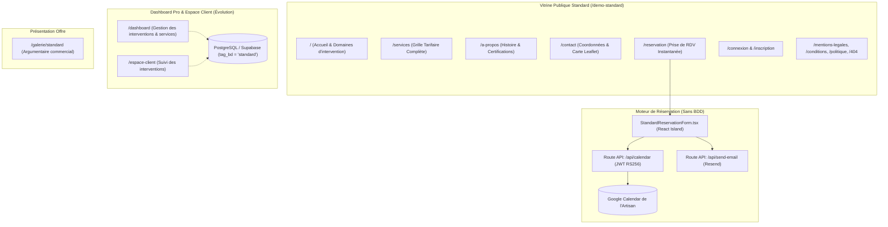

# Présentation Technique & Fonctionnelle — Démo Standard

Ce document détaille l'ensemble des pages, des fonctionnalités, des outils, du modèle de données et de la sécurité régissant la **Démo Standard** de la plateforme de réservation.

---

## 1. Vue d'ensemble & Positionnement

La **Démo Standard** représente la formule **« La Simplicité au service de l'Efficacité — Pack Essentiel / Zéro-DB »**. Conçue autour d'un cas d'usage concret pour artisans et techniciens de proximité — une entreprise de **Dépannage Informatique & Réparation High-Tech à domicile et en atelier (« TechDom »)** —, elle privilégie la vitesse d'exécution, la sobriété d'infrastructure et l'absence totale de contrainte de maintenance de base de données pour le site vitrine.

### Proposition de valeur
- **Site vitrine ultra-performant** : Généré statiquement / hydraté au fil de l'eau, affichant un score *Google PageSpeed > 95%*.
- **Architecture « Zéro Base de Données » (Zero-DB)** : Aucune base de données relationnelle complexe n'est obligatoire pour faire tourner le site vitrine et recevoir des réservations. Les informations métier sont configurées de façon centralisée et typée, et les rendez-vous sont injectés directement dans l'agenda du professionnel (**Google Calendar**).
- **Prise de rendez-vous synchronisée** : Formulaire de réservation instantané avec calcul des créneaux d'intervention et synchronisation bidirectionnelle par API sur l'agenda Google du technicien.
- **Évolutivité garantie** : Bien que pensée pour fonctionner sans base de données, la démo intègre l'infrastructure pour basculer vers un tableau de bord complet avec authentification et gestion de clientèle.

### Stack technique
- **Framework & Rendu** : **Astro v7** (mode SSR / hybride déployé sur le réseau mondial Cloudflare Workers) avec **React 19** pour les îlots dynamiques.
- **Styling & Design System** : **Tailwind CSS v4**, variables thématiques dédiées (`.theme-standard`), typographie moderne et lisible (*CreatoDisplay-Regular*), palette high-tech lumineuse avec fond clair ardoise (`bg-slate-50`), blanc pur (`#ffffff`), bleu cerulean / électrique (`#457b9d` / `bg-blue-600`), bleu givré (`#a8dadc`), et rouge punch (`#e63946`).
- **Synchronisation d'Agenda** : **Google Calendar API v3** via signature cryptographique serveur **JWT RS256** avec la bibliothèque **Jose**.
- **Visualisation & Cartographie** : **Leaflet** (carte interactive pour la zone d'intervention et l'atelier avec fond CartoDB Positron, sans frais d'API).
- **Animations & Expérience Visuelle** : **AOS** (*Animate On Scroll*) pour l'apparition rythmée des blocs, et **Lenis** (*Smooth Scroll*) pour une navigation fluide sans saccades.
- **Services tiers** : **Resend** (notifications et confirmations d'interventions par e-mail).

---

## 2. Architecture Globale



---

## 3. Détail Exhaustif des Pages et Fonctionnalités

### A. Partie Vitrine Publique (`/demo-standard/*`)

Toutes les pages de la vitrine s'appuient sur le layout dédié [StandardLayout.astro](file:///c:/Users/cash31/Desktop/reservation-platform/reservation-platform/src/layouts/StandardLayout.astro), appliquant la classe `theme-standard`, la barre de navigation épurée [StandardHeader.astro](file:///c:/Users/cash31/Desktop/reservation-platform/reservation-platform/src/components/StandardHeader.astro) et le pied de page [Footer.astro](file:///c:/Users/cash31/Desktop/reservation-platform/reservation-platform/src/components/Footer.astro).

| Page | Fichier source | Fonctionnalités clés |
| :--- | :--- | :--- |
| **Accueil TechDom** | [index.astro](file:///c:/Users/cash31/Desktop/reservation-platform/reservation-platform/src/pages/demo-standard/index.astro) | • **Hero High-Tech immersif** : image de fond avec composants électroniques, dégradé slate sombre, badge dynamique avec voyant lumineux clignotant (*ping*), promesse claire : *« Vos problèmes informatiques résolus, directement chez vous »*.<br>• **Processus en 3 étapes** (*Comment ça marche*) : 1. Prise de RDV en ligne, 2. Diagnostic & devis gratuit sur place, 3. Appareil réparé garanti 1 an.<br>• **3 Pôles d'intervention phares** : Smartphones & Tablettes, Ordinateurs (PC & Mac), Télévisions & Périphériques.<br>• **Bloc Tarifs Populaires & Garanties** : mise en avant des interventions fréquentes (écran, batterie, SSD...) avec garanties (déplacement offert dans un rayon de 20 km, devis gratuit, garantie 1 an).<br>• **Carrousel d'avis certifiés** ([TestimonialsCarousel.tsx](file:///c:/Users/cash31/Desktop/reservation-platform/reservation-platform/src/components/TestimonialsCarousel.tsx)) branché sur les retours clients réels.<br>• **Bannière CTA finale percutante** : « Besoin d'un dépannage urgent ? » avec accès direct aux disponibilités. |
| **Grille Tarifaire** | [services.astro](file:///c:/Users/cash31/Desktop/reservation-platform/reservation-platform/src/pages/demo-standard/services.astro) | • Présentation exhaustive des 9 prestations informatiques avec tarifs transparents et durées moyennes estimées en minutes.<br>• Cartes de prestations aérées avec bouton direct « Réserver ».<br>• Encadré d'assistance spéciale pour pannes complexes invitant à demander un devis gratuit. |
| **Histoire & Certifications** | [a-propos.astro](file:///c:/Users/cash31/Desktop/reservation-platform/reservation-platform/src/pages/demo-standard/a-propos.astro) | • Présentation de l'équipe et de sa mission : démocratiser la technologie sans jargon technique.<br>• Photo haute définition d'un technicien réparant un PC avec effet de zoom au survol.<br>• **3 Engagements de confiance** : *Transparence des prix*, *Intervention rapide sous 24h à 48h*, *Pièces certifiées d'origine constructeur*.<br>• **Frise chronologique des certifications** : parcours professionnel balisé (BTS SIO 2016, Certification Apple ACMT 2018, Technicien Réseau & Télécom 2019). |
| **Contact & Zone d'Intervention** | [contact.astro](file:///c:/Users/cash31/Desktop/reservation-platform/reservation-platform/src/pages/demo-standard/contact.astro) | • Coordonnées téléphoniques directes, adresse de l'atelier et e-mail.<br>• **Carte géographique Leaflet interactive** ([Map.astro](file:///c:/Users/cash31/Desktop/reservation-platform/reservation-platform/src/components/Map.astro)) avec repère de géolocalisation.<br>• Formulaire de contact direct traité côté serveur avec acheminement e-mail immédiat via `/api/send-email.ts`. |
| **Réservation d'Intervention (Zéro-DB)** | [reservation.astro](file:///c:/Users/cash31/Desktop/reservation-platform/reservation-platform/src/pages/demo-standard/reservation.astro) | • Intègre le composant autonome [StandardReservationForm.tsx](file:///c:/Users/cash31/Desktop/reservation-platform/reservation-platform/src/components/reservation/StandardReservationForm.tsx) :<br>1. *Choix de la prestation* dans la liste déroulante typée.<br>2. *Sélection du jour et du créneau* : calcul automatique à la volée des tranches horaires d'une heure (9h-19h en semaine, 10h-18h le samedi, fermé le dimanche, exclusion des créneaux passés).<br>3. *Coordonnées client* : validation rigoureuse des champs (nom, email, téléphone) via **Zod**.<br>• **Injection directe dans Google Calendar** via l'API `/api/calendar.ts`.<br>• Envoi simultané d'un e-mail de confirmation au client via Resend. |
| **Authentification** | [connexion.astro](file:///c:/Users/cash31/Desktop/reservation-platform/reservation-platform/src/pages/demo-standard/connexion.astro)<br>[inscription.astro](file:///c:/Users/cash31/Desktop/reservation-platform/reservation-platform/src/pages/demo-standard/inscription.astro) | • Formulaires d'accès utilisateur et inscription pour les fonctionnalités avancées. |
| **Réinitialisation de mot de passe** | [mot-de-passe-oublie.astro](file:///c:/Users/cash31/Desktop/reservation-platform/reservation-platform/src/pages/demo-standard/mot-de-passe-oublie.astro)<br>[reinitialiser-mot-de-passe.astro](file:///c:/Users/cash31/Desktop/reservation-platform/reservation-platform/src/pages/demo-standard/reinitialiser-mot-de-passe.astro) | • Procédure de reset password sécurisée gérée via Supabase Auth. |
| **Mentions Légales & RGPD** | [mentions-legales.astro](file:///c:/Users/cash31/Desktop/reservation-platform/reservation-platform/src/pages/demo-standard/mentions-legales.astro)<br>[conditions-utilisation.astro](file:///c:/Users/cash31/Desktop/reservation-platform/reservation-platform/src/pages/demo-standard/conditions-utilisation.astro)<br>[politique-de-confidentialite.astro](file:///c:/Users/cash31/Desktop/reservation-platform/reservation-platform/src/pages/demo-standard/politique-de-confidentialite.astro) | • Conformité légale complète, droits sur les données personnelles et conditions de dépannage informatique. |
| **Page d'Erreur 404** | [404.astro](file:///c:/Users/cash31/Desktop/reservation-platform/reservation-platform/src/pages/demo-standard/404.astro) | • Page 404 sur mesure avec lien de retour rapide à l'accueil. |
| **Page Commerciale Formule** | [galerie/standard.astro](file:///c:/Users/cash31/Desktop/reservation-platform/reservation-platform/src/pages/galerie/standard.astro) | • Vitrine de vente de l'offre Standard (« La Simplicité au service de l'Efficacité »), mettant en avant l'absence de base de données à administrer, la vitesse de chargement et le coût d'hébergement minimal. |

---

### B. Le Moteur de Réservation Spécifique : Zero-DB & Google Calendar

Contrairement aux démos Diamant et Premium qui enregistrent les réservations dans une table PostgreSQL `appointments`, la **Démo Standard** utilise une approche innovante **« Zero-DB »** basée sur [StandardReservationForm.tsx](file:///c:/Users/cash31/Desktop/reservation-platform/reservation-platform/src/components/reservation/StandardReservationForm.tsx) :

```
┌────────────────────────────────────────────────────────────────────────────────────────┐
│                        TUNNEL DE RÉSERVATION DÉMO STANDARD                             │
│                                                                                        │
│  1. Prestation : [ Diagnostic Complet (30 min — 39 €)                      ▼ ]        │
│  2. Date :       [ 2026-09-28 ]  ──>  [ Afficher les créneaux ]                        │
│                  Créneaux : [ 09:00 ] [ 10:00 ] [ 11:00 ] [ 14:00 ] [ 15:00 ]         │
│  3. Vos infos :  Nom: [ Jean Dupont ]  Email: [ jean@example.com ]  Tél: [ 06... ]     │
│                                                                                        │
│                  [ Confirmer la réservation d'intervention ]                           │
└────────────────────────────────────────┬───────────────────────────────────────────────┘
                                         │
                   POST /api/calendar    │    POST /api/send-email
                   ──────────────────────┴───────────────────────
                   ▼                                             ▼
        ┌───────────────────────┐                     ┌─────────────────────┐
        │   GOOGLE CALENDAR     │                     │       RESEND        │
        │ Événement créé :      │                     │ Email de            │
        │ "Intervention:        │                     │ confirmation envoyé │
        │  Diagnostic - Jean D."│                     │ au client           │
        └───────────────────────┘                     └─────────────────────┘
```

#### Fonctionnement technique détaillé :
1. **Génération instantanée des créneaux côté client** (`generateSlots`) :
   - Horaires d'ouverture : 9h-19h du lundi au vendredi, 10h-18h le samedi, fermé le dimanche.
   - Périodes de 1h générées à la volée.
   - Rejet automatique des heures passées pour la journée en cours (`start > new Date()`).
2. **Synchronisation d'agenda via `/api/calendar.ts`** :
   - Authentification au service Google sans interaction utilisateur via un **Compte de Service Google** (*Service Account*).
   - Signature asymétrique d'un token JWT avec l'algorithme **RS256** et la clé privée PKCS#8 (`GOOGLE_PRIVATE_KEY`).
   - Requête vers l'API OAuth2 de Google pour obtenir un `access_token` temporaire d'une heure.
   - Insertion de l'événement dans le calendrier cible (`GOOGLE_CALENDAR_ID`) contenant : le titre de l'intervention, le nom du client, son téléphone, son e-mail et le libellé du service.
3. **Protection contre les abus & Rate Limiting** :
   - Un cookie sécurisé HTTP-only (`calendar_sync_history`) mémorise les réservations de la session :
     - Maximum **3 réservations par session**.
     - Délai d'attente obligatoire de **5 minutes entre deux réservations consécutives**.
     - Blocage par code HTTP `429 Too Many Requests` en cas de dépassement.
4. **Confirmation e-mail transactionnelle** :
   - Expédition immédiate d'un récapitulatif HTML au client via l'API **Resend**.

---

### C. Dashboard & Espace Client (Passerelle d'Évolution)

La démo Standard met à disposition une interface d'administration épurée basée sur [DashboardLayout.astro](file:///c:/Users/cash31/Desktop/reservation-platform/reservation-platform/src/layouts/DashboardLayout.astro) et [DashboardNav.tsx](file:///c:/Users/cash31/Desktop/reservation-platform/reservation-platform/src/components/dashboard/DashboardNav.tsx) :

1. **Dashboard Pro (`/demo-standard/dashboard/*`)** :
   - `index.astro` : Vue d'ensemble et liste des rendez-vous enregistrés ([AppointmentsPanel.tsx](file:///c:/Users/cash31/Desktop/reservation-platform/reservation-platform/src/components/dashboard/AppointmentsPanel.tsx)).
   - `services.astro` : Gestion des forfaits de dépannage ([ServicesPanel.tsx](file:///c:/Users/cash31/Desktop/reservation-platform/reservation-platform/src/components/dashboard/ServicesPanel.tsx)).
   - `disponibilites.astro` : Gestion des règles d'ouverture et congés ([AvailabilitiesPanel.tsx](file:///c:/Users/cash31/Desktop/reservation-platform/reservation-platform/src/components/dashboard/AvailabilitiesPanel.tsx)).
   - `clients.astro` : Répertoire clientèle et suivi des interventions ([ClientsPanel.tsx](file:///c:/Users/cash31/Desktop/reservation-platform/reservation-platform/src/components/dashboard/ClientsPanel.tsx)).
   - `statistiques.astro` : Métriques d'activité et volumes d'interventions.
   - `profil.astro` : Coordonnées et description de l'entreprise TechDom ([ProfilePanel.tsx](file:///c:/Users/cash31/Desktop/reservation-platform/reservation-platform/src/components/dashboard/ProfilePanel.tsx)).

2. **Espace Client (`/demo-standard/espace-client/*`)** :
   - `index.astro` : Consultation et gestion de ses rendez-vous ([AppointmentsClientPanel.tsx](file:///c:/Users/cash31/Desktop/reservation-platform/reservation-platform/src/components/client/AppointmentsClientPanel.tsx)).
   - `fidelite.astro` : Points et avantages fidélité ([LoyaltyClientPanel.tsx](file:///c:/Users/cash31/Desktop/reservation-platform/reservation-platform/src/components/client/LoyaltyClientPanel.tsx)).
   - `messages.astro` : Messagerie avec le technicien ([MessagesClientPanel.tsx](file:///c:/Users/cash31/Desktop/reservation-platform/reservation-platform/src/components/client/MessagesClientPanel.tsx)).
   - `profil.astro` : Coordonnées personnelles ([ClientProfilePanel.tsx](file:///c:/Users/cash31/Desktop/reservation-platform/reservation-platform/src/components/client/ClientProfilePanel.tsx)).

---

## 4. Données & Stockage : Philosophie « Zéro Base de Données »

### Stockage Centralisé dans le Code (`itRepairConfig`)

Toutes les données publiques du site vitrine sont définies dans l'objet typé `itRepairConfig` situé dans [src/config/site.ts](file:///c:/Users/cash31/Desktop/reservation-platform/reservation-platform/src/config/site.ts) :

```typescript
export const itRepairConfig = {
    business: {
        name: 'TechDom',
        activity: 'Dépannage Informatique',
        tagline: 'Vos problèmes informatiques résolus, directement chez vous.',
        address: '45 Avenue de la République, 75011 Paris',
        phone: '01 99 88 77 66',
        email: 'contact@techdom-reparation.fr',
        openingHours: [
            { day: 'Lundi - Vendredi', hours: '9h00 - 19h00' },
            { day: 'Samedi', hours: '10h00 - 18h00' },
            { day: 'Dimanche', hours: 'Fermé' }
        ]
    },
    services: [
        { name: 'Diagnostic Complet', durationMinutes: 30, price: 39 },
        { name: 'Changement Écran Smartphone/Tablette', durationMinutes: 60, price: 0 },
        { name: 'Remplacement Batterie', durationMinutes: 30, price: 49 },
        { name: 'Connecteur de Charge', durationMinutes: 60, price: 59 },
        { name: 'Mise à niveau Composants PC', durationMinutes: 60, price: 79 },
        { name: 'Réparation TV (Changement Dalle)', durationMinutes: 120, price: 0 },
        { name: 'Dépannage Imprimante', durationMinutes: 45, price: 49 },
        { name: 'Nettoyage Logiciel & Virus', durationMinutes: 60, price: 59 },
        { name: 'Installation Pack Office', durationMinutes: 30, price: 49 }
    ],
    // Engagements, diplômes et avis clients certifiés...
};
```

### Avantages de l'approche Zéro-DB
1. **Zéro latence de requête réseau** : Le contenu est rendu instantanément lors du build ou servi à la volée depuis la mémoire du worker Cloudflare Edge.
2. **Vulnérabilités de bases de données éliminées** : Aucun risque d'injection SQL sur la vitrine publique, aucune faille liée aux ports de base de données exposés.
3. **Coût d'hébergement minimal** : Aucun serveur de base de données à dimensionner ou à payer mensuellement.
4. **Synchronisation directe dans le quotidien du pro** : Le professionnel n'a pas besoin de consulter un tableau de bord supplémentaire : chaque rendez-vous apparaît directement sur son smartphone via son **Google Calendar personnel ou professionnel**.

### Passerelle d'évolution Supabase (`tag_bd = 'standard'`)
Pour les clients souhaitant évoluer vers une gestion avec base de données complète sans changer de site :
- La colonne `tag_bd` dans les tables PostgreSQL de Supabase accepte la valeur `'standard'`.
- La fonction `getSiteConfig(currentPath)` détecte automatiquement le préfixe `/demo-standard` et permet de basculer en mode base de données à la demande.

---

## 5. Sécurité et Contrôle d'Accès

### A. Sécurité de l'API Google Calendar (JWT & Service Account)
- L'accès à l'agenda ne passe **jamais par le navigateur**. Le client web n'a connaissance ni de la clé privée, ni de l'identifiant du compte de service.
- La signature cryptographique s'effectue exclusivement côté serveur dans la route Astro `/api/calendar.ts` :
  - Clé privée au format PKCS#8 importée dynamiquement via `importPKCS8`.
  - Signature `RS256` générant un jeton JWT avec une durée de validité limitée à **1 heure**.
  - Portée restreinte (*scope*) minimale : `https://www.googleapis.com/auth/calendar.events`.

### B. Rate Limiting et Anti-Spam
- Pour empêcher qu'un robot ou un utilisateur malveillant ne sature l'agenda Google du technicien :
  - **Cookie HTTP-Only chiffré** `calendar_sync_history` horodaté sur 24 heures.
  - Plafond strict de **3 réservations par session**.
  - Intervalle de temporisation obligatoire de **5 minutes entre chaque réservation**.
  - En cas de tentative abusive, l'API renvoie un statut HTTP `429` avec le nombre de minutes restantes à attendre.

### C. Validation Typée des Formulaires
- Le formulaire de réservation utilise **Zod** et **React Hook Form** :
  - Validation stricte du format d'e-mail.
  - Longueur minimale du nom.
  - Nettoyage et assainissement des entrées avant expédition.

### D. Confinement des Clés d'Environnement
- Les clés suivantes sont strictement confinées au serveur (Cloudflare Secrets / `.env`) et invisibles côté client :
  - `GOOGLE_SERVICE_ACCOUNT_EMAIL`
  - `GOOGLE_PRIVATE_KEY`
  - `GOOGLE_CALENDAR_ID`
  - `RESEND_API_KEY`

---

## 6. Synthèse des Outils et Bibliothèques Utilisés

| Outil / Bibliothèque | Version / Type | Rôle spécifique dans la Démo Standard |
| :--- | :--- | :--- |
| **Astro** | v7.1.1 | Moteur de rendu SSR / Jamstack ultra-rapide déployé sur Cloudflare Workers (PageSpeed > 95%). |
| **React** | v19.2.7 | Gestion des îlots interactifs dynamiques ([StandardReservationForm.tsx](file:///c:/Users/cash31/Desktop/reservation-platform/reservation-platform/src/components/reservation/StandardReservationForm.tsx), carrousels d'avis). |
| **Google Calendar API** | v3 | Destination principale des réservations de rendez-vous en direct, sans base de données locale. |
| **Jose** | v6.2.12 | Création et signature cryptographique serveur des tokens JWT PKCS#8 / RS256 pour Google OAuth2. |
| **Tailwind CSS** | v4.3.3 | Design system moderne sur thème clair high-tech (`.theme-standard`, palette slate/bleu électrique/rouge punch). |
| **Leaflet** | v1.9.4 | Affichage de la carte interactive d'intervention et de l'atelier sur la page contact. |
| **Resend** | API v2 | Expédition instantanée des e-mails transactionnels de confirmation de rendez-vous et messages de contact. |
| **AOS & Lenis** | v2.3.4 / v1.3.26 | Effets d'apparition en cascade au scroll et défilement fluide sans ralentissement. |
| **React Hook Form & Zod** | v7.82 / v4.4 | Validation typée et sécurisée des données saisies dans le formulaire de prise de rendez-vous. |
| **Lucide React** | v1.25.0 | Bibliothèque d'icônes adaptées au domaine informatique (`Laptop`, `Smartphone`, `Wrench`, `ShieldCheck`). |
